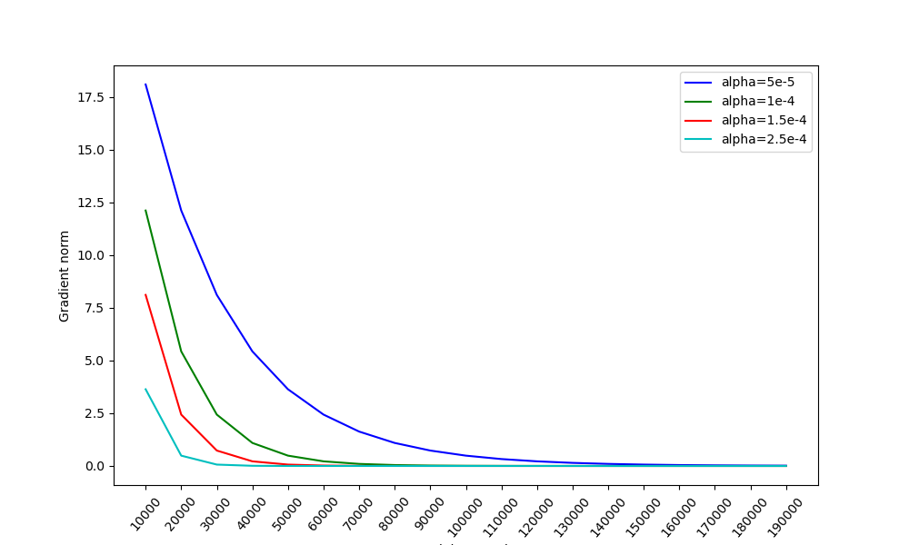
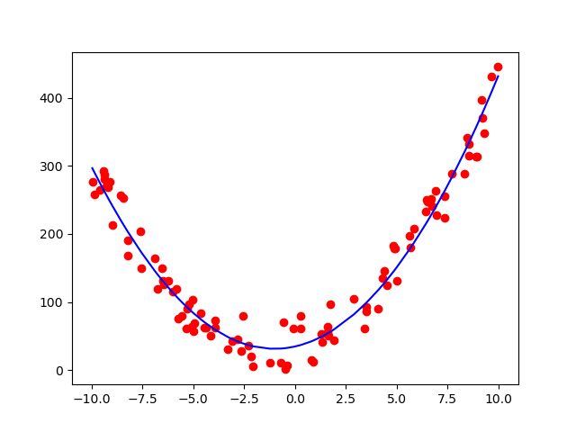
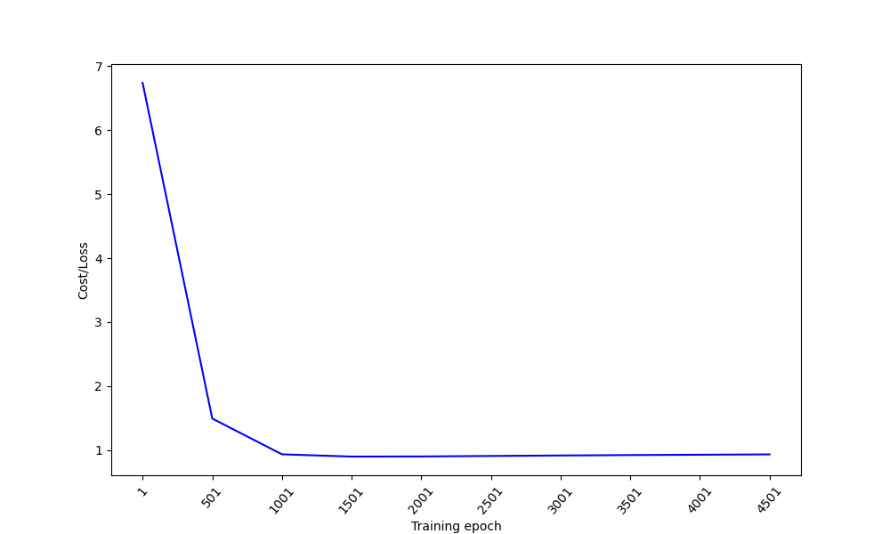

# Project 4': Machine Learning for Image Classification


## Curve Fitting (milestone1)

This part the code fits a second order curve using **gradient descent** algorithm. 

### Setting

The code is in Python 3.8. To run the code, modify the parameters in `./milestone1/curve_fitting/gradient_descent_solver.py` and
```
cd milestone1/curve_fitting
python gradient_descent_solver.py
```

The script would start a training job using the data in `./milestone1/points.txt`, and plot the simulated curve in `./milestone1/prd.png`.

Required dependencies
```
numpy==1.20.3
matplotlib==3.3.4
```

### Algorithm

The algorithm is gradient descent on MSE with respect to a second-order function curve with form:
$$
y=h^2x+mx+b
$$
and the loss function to minimize is 
$$
E(h,m,b)=\frac{1}{n}\sum_{i=1}^n(y_i-(hx_i^2+mx_i+b))^2
$$

The gradient of the loss function could be expressed as a vector
$$
\nabla E=(\frac{\partial E}{\partial h}, \frac{\partial E}{\partial m}, \frac{\partial E}{\partial b})
$$
where each partial derivate could be calculated from $E(h,m,b)$
- $$\frac{\partial E}{\partial h}=2hx^4+2mx^3+2bx^2-2x^2y$$
- $$\frac{\partial E}{\partial m}=2hx^3+2mx^2+2bx-2xy$$
- $$\frac{\partial E}{\partial b}=2hx^2+2mx+2b-2y$$

### Analysis & Plots

The value for alpha (learning rate) is initially set to 2.5e-4 as suggested. What is vey intuitive is that, as the alpha decreases, the speed of convergence decreases as well, while the norm of the gradient keeps decreasing through the iteration. When I increase the alpha, the convergence remain until the alpha hits **4.2e-4**. For alpha greater than 4.2e-4, the norm will increase as the iteration goes through and eventually becomes infinite.

The following figure describes how the convergence speed changes and whether there will be a convergence within a limit of epoch as alpha changes. All experiments are run with $\epsilon$=1e-5 and the limit of epoch set to 200000. The figure starts from the norm as epoch 10000 and does not involve the norm at epoch 1, since that is usually very large and will give the figure an irrational scale. Please not that for alpha=5e-6, the training does not converge in 200000 epoches, although the norm has been very close to zero.




The second order curve fit (blue) and the training data points (red) are plotted in the following figure. The alpha is set to 1e-4. The values for the optimal fit are
- $h=3.3088$
- $m=6.7270$
- $b=34.7113$



## Neural Network - Python (milestone1)

This section briefly describes the implementation of training a neural network on MNIST dataset using only Python and numpy. The main goal of this part is to familiarize with the stochastic gradient descent algorithm by implementing matrix multiplicationa (dense algebra) with the help of Numpy, as well as the loading the MNIST dataset and the whole training procedure.

### Setting

The code is in Python 3.8. To run the code, run the scripe `./milestone1/neural_network/gradient_descent_solver.py` and pass 4 arguments as indicated in the assignment: the number of intermediate layers, the number of units in an intermediate layer, the number of training epochs and batch size. For example,
```
cd milestone1/neural_network
python gradient_descent_solver 4 200 15000 16
```

The script would start a training job using the MNIST dataset in `./data/`. A neural network will be trained for the given epochs and an evaluation is performed on the test dataset at the end of the training.

Required dependencies
```
numpy==1.20.3
```

### Fully Connected Neural Network Class

Class `FNNForMNIST` is defined in `fnn.py` and stores each layer's information including weight, bias, weighted input $w$, activation $a$ and error $\delta$, dimension for input layer, hidden layer and output layer, number of hidden layers, learning rate, and most importantly the procedure for an epoch of training.

The weights and bias for each layer are initialized in the constructor, with there appropriate size.
```python
self.weights = []
self.bias = []

# Create weight matrix and bias vector for each layer
for i in range(num_dense + 1):
    # Input layer
    if i == 0:
        self.weights.append(np.eye(28 * 28, self.hidden_dim))
        self.bias.append(np.ones(self.hidden_dim))
    # Output layer
    elif i == num_dense:
        self.weights.append(np.eye(self.hidden_dim, self.output_dim))
        self.bias.append(np.ones(self.output_dim))
    # Other intermediate layer
    else:
        self.weights.append(np.eye(self.hidden_dim, self.hidden_dim))
        self.bias.append(np.ones(self.hidden_dim))
```

The activation function for this assignment is *sigmoid* which is defined along with its derivative
```python
@staticmethod
def sigmoid(x):
    return 1.0 / (1.0 + math.exp(-x))

@staticmethod
def sigmoid_derivative(x):
    sigmoid = 1.0 / (1.0 + math.exp(-x))
    return sigmoid * (1 - sigmoid)
```

The function `step()` performs a training step for a batch of input data, including forward propogation, error computing, and backward propogation. In order for the backpropogation, the weighted input, activation and error for each layer are stored as they are calculated.

- The forward propogation is composed of a series matrix multiplication. The input data with size [batch_size, 28*28] is first transformed into [batch_size, hidden_dim] after passing through the input layer, and at last is tranformed into [batch_size, 10] after passing through the output layer. In each layer the data is also added by this layer's bias and activated by sigmoid function.
```python
hidden_state = np.dot(hidden_state, self.weights[i + 1])  # -> [batch_num, hidden_dim]
for j in range(batch_size):
    hidden_state[j] = np.add(hidden_state[j], self.bias[i + 1])
```

- The error at the last layer is computed across the output of the neural network and the label for this batch of data. It is a pairwise production of the derivative of cost function with respect to the output and the derivative sigmoid function on the last weighted input.
```python
self.error.append(np.multiply(np.abs(labels - output), self.sigmoid_derivative_matrix(hidden_state)))  # -> [batch_num, output_dim]
```

- The backward propogation consists of error propogation and gradient descent to update parameters. Error propogation at each layer involves next layer's weight, next layer's error and this layer's weighted input. 
```python
self.error.append(
    np.multiply(
        np.dot(self.error[-1], np.transpose(self.weights[i + 1])), 
        self.sigmoid_derivative_matrix(self.z[i])
    )
)
```
For gradient descent, weights are updated by aggregating this layer's error and the previous layer's activation along the batch_size dimension, while bias are updated by accumulating this layer's error along batch_size dimension.
```python
grad_w = np.dot(
    np.transpose(self.activation[i]), 
    self.error[self.hidden_layer_num - i]
)
self.weights[i] = self.weights[i] - self.lr / float(batch_size) * grad_w
self.bias[i] = self.bias[i] - self.lr / float(batch_size) * np.sum(self.error[self.hidden_layer_num - i], axis=0)
```

### MNIST Dataset Class

In addition to the NN class, class `MNISTDataset` defined in `dataset.py` reads from disk the MNIST dataset (train or test) and randomly generate a batch of samples as input to NN. 

The image and label data are read as bytes and converted to integers using "big endian" standard. The program set the file pointer to an offset to read an image or a label.
```python
f_image.seek(self.offset)
fig_data.append(int.from_bytes(f_image.read(1), "big"))
```

After storing all the images and labels in an array, function `get_batch_data()` generates a batch of randomly sampled data. In order to ensure the new image is randomly selected from a set of unselected images, each time the random number is generate in range of [0, # num_figs - # sampled_figs], and swap the selected image with the last unselected image in the array. In implementation the indices for images are swapped instead the actual images.
```python
# Generate random int in range [0, num_figs-1 - sampled_num]
index = random.randint(0, self.num_figs - 1 - self.sampled_num)
sampled_indices.append(index)
images.append(self.fig_data[self.indices[index]])
labels.append(self.fig_label[self.indices[index]])
# Swap the index with the last unsampled index
self.indices[index], self.indices[self.num_figs - 1 - self.sampled_num] = \
    self.indices[self.num_figs - 1 - self.sampled_num], self.indices[index]
self.sampled_num += 1
```
The function also convert the numerical labels to one-hot vectors.

### Training

The training procedure is quite simple. A neural network and a dataset are created with input configurations, and is trained iteratively by fetching a batch of data, input them to the nerual network, perform the forward propogate and backward propogate, and print loss every a couple of epochs. 

### Results

The following plot shows the change of cost(loss) as the training epoch increases. Configurations for this experiment are
- Number of hidden layers: 2
- Dimension of hidden layer: 100
- Batch size: 16
- Learning rate: 0.0005

The loss dropped significantly at the beginning of training. However, as the training keeps going, the loss shows a very slow trend of increasing (slightly upward line). This may indicate that the simple neural network (4 linear layers in total) has a very limited capability of learning and is challenged to perform the image classification task.



## Neural Network - C (final)

### Setting and Results

The code is in C and complied as follows:
```
train:train.c mnist.h mnist.c fnn.h fnn.c matrix.h matrix.c
	gcc -O2 train.c mnist.c fnn.c matrix.c -o train -lm
```

Pass 4 arguments as before to run the program:
```
./train 2 100 3 16
```

The program will print to stdout the following lines:
```
Loaded MNIST training set.
Batch num: 3751
Epoch: [1/3]    Batch: [1/3751] Loss: 6.324555
Epoch: [1/3]    Batch: [501/3751]       Loss: 0.891776
Epoch: [1/3]    Batch: [1001/3751]      Loss: 0.415726
Epoch: [1/3]    Batch: [1501/3751]      Loss: 0.262582
Epoch: [1/3]    Batch: [2001/3751]      Loss: 0.189207
Epoch: [1/3]    Batch: [2501/3751]      Loss: 0.146733
Epoch: [1/3]    Batch: [3001/3751]      Loss: 0.119248
Epoch: [1/3]    Batch: [3501/3751]      Loss: 0.100103
All training data is exhausted. Starting a new iteration.
Epoch: [2/3]    Batch: [1/3751] Loss: 0.092545
...
```

For a neural network consisting of 2 hidden layers with 100 units, the grind rate (samples/second) is **4186**.

### Implementation

The implementation is somewhat similar to the python version. There are totally three structs:
- `MNISTDataset` declared in `mnist.h`;
- `FNNForMNIST` declared in `fnn.h`;
- `Matrix` declared in `matrix.h`;

The logics for `MNISTDataset` and `FNNForMNIST` are simliar to those in python version, so I did not include too much details here. The struct `Matrix` contained a series of matrix operations involved in a training step. The operations are
```c
// Create a matrix
Matrix create_matrix(int row, int col);
// Matrix multiplication
Matrix matrix_dotp(Matrix a, Matrix b);
// Matrix add
Matrix matrix_add(Matrix a, Matrix b);
// Matrix sub
Matrix matrix_sub(Matrix a, Matrix b);
// Matrix element-wise multiplication
Matrix matrix_multiply(Matrix a, Matrix b);
// Matrix transpose
Matrix matrix_transpose(Matrix m);
// Convert from a double**
Matrix convert_to_matrix(double** a, int row, int col);
// Apply sigmoid function on each element of the matrix
void matrix_sigmoid(Matrix* a);
// Apply derivative sigmoid function 
void matrix_sigmoid_reverse(Matrix* a);
// Add bias to each row of the matrix
void matrix_addbias(Matrix* m, double* b);
// Linear scale the matrix
void matrix_scale(Matrix* m, double s);
// Return the normalization of the matrix
double matrix_norm(Matrix* m);
```

With `Matrix` and its operations being defined, all the data structures that has type `numpy.array` in python version could be converted to a `Matrix` struct
```C
fnn->weights = (Matrix*)malloc(sizeof(Matrix)*(num_dense+1));
fnn->activation = (Matrix*)malloc(sizeof(Matrix)*(fnn->hidden_layer_num+1));
fnn->z = (Matrix*)malloc(sizeof(Matrix)*(fnn->hidden_layer_num+1));
fnn->error = (Matrix*)malloc(sizeof(Matrix)*(fnn->hidden_layer_num));
```

## Neural Network - CUDA (final)

For this part of work, I had tried my best effort but I did not manage to made it finally. Here I describe all my thoughts and efforts for the CUDA parallelization implementation, although they did not come to a successful end.

Firstly, I figured out two possible ways to parallize it on GPU. One is to assign each thread an image in a mini-batch, do the forward and backward in parallel for each image, collect and average gradient from each thread, and update parameters for each thread indentically. The problem for this solution is, the speed up effect is limited to the size of a batch. For example, for a training procedure with batch size 16, at most 16x faster could be gained using CUDA. The effect becomes more vague for a smaller batch size. 

Another possible solution is to parallelize the matrix mulitplication part. This is because computing an element in the result matrix is independent to computing other result elements. Speed up effect for this solution would be much more ideal than the previous solution. The problem is, a learning step (forward propogatation - back propogatation - parameters updating) consists of more than one matrix multiplication, which means the kernal function finishing a matrix multiplication operation would be called multiple times in a training step. This lead to additional cost on memory copy between CPU and GPU. However, the cost could be somewhat amortized by increasing the batch size and thus reduce the training steps. So I decided to implement this strategy.

In order to implement this strategy, the matrix multiplication is modified as
```C
__global__
void flat_matrix_dotp(double* c, double* a, double* b, int row, int col, int dim){
    int index = blockIdx.x * blockDim.x + threadIdx.x;

    int target_row = index / col;
    int target_col = index % col;

    for (int i = 0; i < dim; i++){
        c[target_row * col + target_col] = a[target_row * dim + i] * b[i * dim + col];
    }
}
```

Another import change is that, the storage of a matrix (including weights, activations, errors, and weighted outputs) must be a 1-d array, so that it is possible to copy the memory to CUDA. In this regard, the struct `Matrix` is not applicable in this context. Every matrix is malloced and stored as 1-d array, instead a `Matrix`
```C
fnn->weights = (double**)malloc(sizeof(double*)*(num_dense+1));
for (int i = 0; i < num_dense+1; i++){
    if (i == 0){
        fnn->weights[i] = (double*)malloc(sizeof(double)*(fnn->input_dim * fnn->hidden_dim));
    }
    else if (i == num_dense){
        fnn->weights[i] = (double*)malloc(sizeof(double)*(fnn->output_dim * fnn->hidden_dim));
    }
    else{
        fnn->weights[i] = (double*)malloc(sizeof(double)*(fnn->hidden_dim * fnn->hidden_dim));
    }
}

fnn->activation = (double**)malloc(sizeof(double*) * (fnn->hidden_layer_num+1));
fnn->z = (double**)malloc(sizeof(double*) * (fnn->hidden_layer_num+1));
fnn->error = (double**)malloc(sizeof(double*) * (fnn->hidden_layer_num));

```

In addition to matrix multiplicaton, other matrix operations are also modified to be suited to the 1-d data structure
```C
void flat_matrix_sub(double* c, double* a, double* b, int row, int col);
void flat_matrix_multiply(double* c, double* a, double* b, int row, int col);
void flat_matrix_sigmoid(double* a, int row, int col);
void flat_matrix_sigmoid_reverse(double* a, int row, int col);
void flat_matrix_addbias(double* m, int row, int col, double* b);
double flat_matrix_norm(double* m, int row, int col);
``` 

Below is an example of launching a kernal function to complete a matrix multiplication on GPU
```C
// Array on CUDA
double* hidden_states;
cudaMalloc((void**)&hidden_states, sizeof(double) * batch_size * fnn->hidden_dim);
// Array on CPU
double* hidden_states_host = (double*)malloc(sizeof(double) * batch_size * fnn->hidden_dim);
memset(hidden_states_host, 0, sizeof(double) * batch_size * fnn->hidden_dim);
// Copy to CUDA
cudaMemcpy(hidden_states, hidden_states_host, sizeof(double) * batch_size * fnn->hidden_dim, cudaMemcpyHostToDevice);

double* act;
cudaMalloc((void**)&act, sizeof(double) * batch_size * IMG_SIZE);
cudaMemcpy(act, fnn->activation[0], sizeof(double) * batch_size * IMG_SIZE, cudaMemcpyHostToDevice);

double* w;
cudaMalloc((void**)&w, sizeof(double) * fnn->hidden_dim * fnn->hidden_dim);
cudaMemcpy(w, fnn->weights[0], sizeof(double) * fnn->input_dim * fnn->hidden_dim, cudaMemcpyHostToDevice);

// Kernal function
flat_matrix_dotp<<<nblocks, nthreads_per_block>>>(
    hidden_states, 
    act, 
    w, 
    batch_size,
    fnn->hidden_dim,
    fnn->input_dim
); // -> [batch_size, hidden_dim]
cudaDeviceSynchronize();
```

The procedure is similar for all the forward propogation, back propogation and gradient descent. However, I did not manage to debug all the part so the whole program could not be run as required, same as the following experiments about grind rate. The bugs are about `cudaMalloc` and `cudaMemcpy`, and I had spent a couple of days trying to resovle all of them. 

## Conclusion

For this project, I have tried my best effort to follow the instructions, finishing the curve fitting, neural network in python, neural network in C and partly neural network in CUDA. Although I did not complete all the work for the CUDA part, I describe the thoughts and efforts I made for this part and had learned a lot about CUDA programming from this. Thanks for your comprehension!
